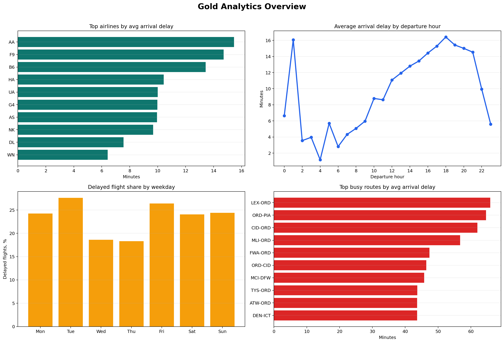
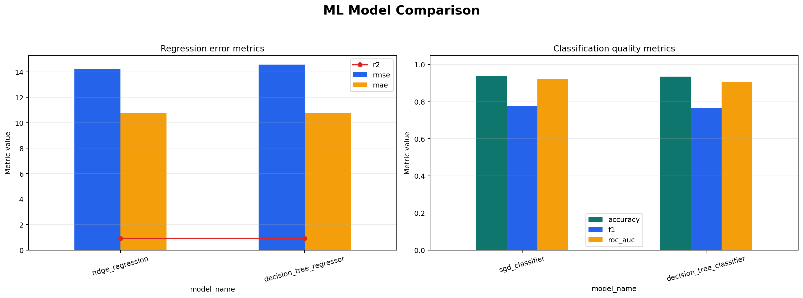
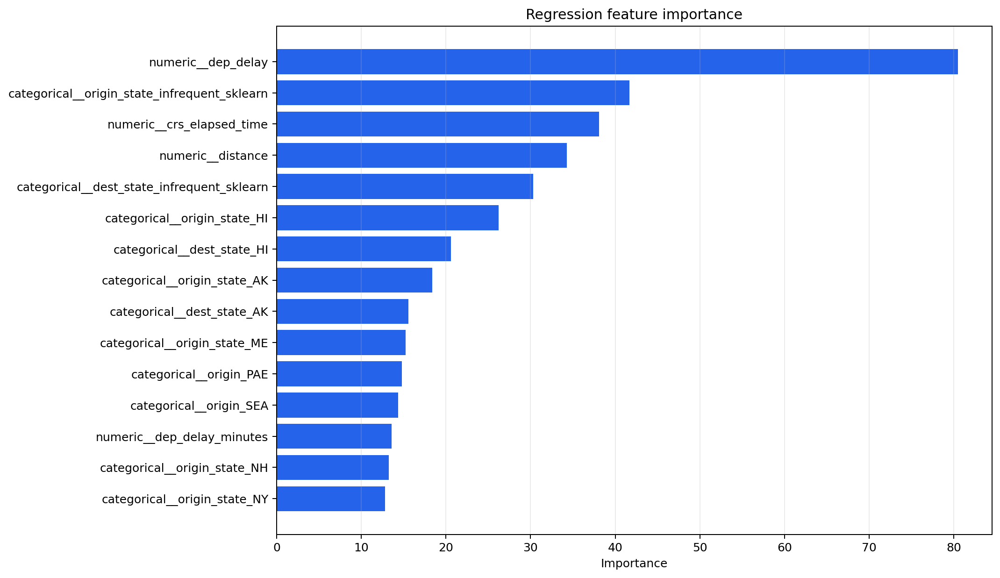
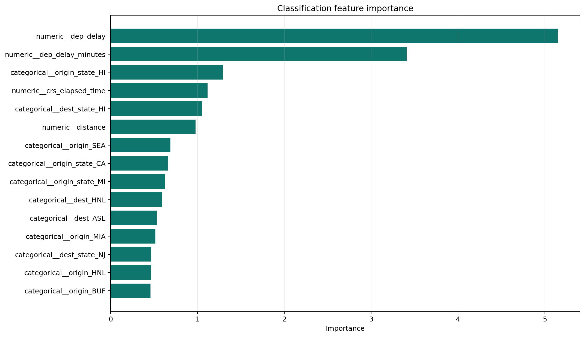

# Big Data Lab 3

Лабораторная работа по сборке lakehouse-пайплайна для датасета задержек авиарейсов на `Polars + Delta Lake`.

## Структура

```text
.
├── Dockerfile
├── data/
├── docker-compose.yml
├── flight_data_2018_2024.csv
├── logs/
├── mlruns/
├── pyproject.toml
├── reports/
└── src/
    └── lakehouse/
        ├── __init__.py
        ├── __main__.py
        ├── bronze.py
        ├── cli.py
        ├── config.py
        ├── gold.py
        ├── ml.py
        ├── report_plots.py
        └── silver.py
```

Назначение папок и основных файлов:

- `src/`: исходный код пайплайна и CLI-команд.
- `src/lakehouse/`: модули слоев `bronze`, `silver`, `gold` и ML-этапа.
- `logs/`: журналы запусков пайплайна.
- `data/`: локальное lakehouse-хранилище с Delta-таблицами.
- `mlruns/`: локальное хранилище экспериментов `MLflow`.
- `reports/`: итоговые артефакты для отчета, включая сохраненные графики.
- `Dockerfile`: образ приложения с Python-зависимостями и CLI `lakehouse`.
- `docker-compose.yml`: совместный запуск контейнеров `app` и `mlflow`.
- `flight_data_2018_2024.csv`: исходный CSV-датасет.
- `pyproject.toml`: зависимости проекта и конфигурация Python-пакета.
- `README.md`: описание решения и итоговый отчет по лабораторной.

## Что делает bronze

- читает CSV через `Polars Lazy API`;
- нормализует проблемные имена колонок;
- определяет доступные даты в колонке `FlightDate`;
- загружает каждый день в Delta отдельным `append`-батчем;
- добавляет служебные поля `source_date`, `source_year`, `source_file`, `ingested_at`, `ingestion_batch`;
- при повторном запуске пропускает уже загруженные дни, если не передан `--force`.

Это дает историю версий Delta и имитирует инкрементальную ежедневную поставку данных.

## Что делает silver

- читает `bronze` через `pl.scan_delta(...)`;
- удаляет отмененные и перенаправленные рейсы;
- отбрасывает строки без ключевых полей и явные выбросы по задержкам/временам;
- нормализует категориальные поля `marketing_airline`, `operating_airline`, `origin`, `dest`, `tail_number`;
- оставляет curated-подмножество колонок для аналитики и ML;
- строит признаки `dep_hour`, `arr_hour`, `day_of_week`, `season`, `route`, `is_delayed`;
- пишет Delta-таблицу с `partition_by=["year", "month"]`;
- при повторном запуске синхронизирует таблицу через `MERGE` по `flight_id`, а не создает дубли.

### Почему partition_by=["year", "month"]

- silver и будущие gold-витрины естественно режутся по календарным окнам;
- `year/month` дает умеренную кардинальность партиций и не приводит к избыточному дроблению файлов;
- дневная гранулярность уже отражена на уровне `bronze`, а в `silver` важнее удобный доступ для аналитики и ML-фичей по месяцам и сезонам.

Для `gold` выбраны похожие принципы:

- feature table партиционируется по `year/month`, потому что это основной временной срез для обучения и бэктестов;
- analytics mart партиционируется по `aggregation_level/year/month`, чтобы агрегаты по аэропортам, авиакомпаниям, часу, дню недели, сезону и маршрутам лежали отдельно и читались точечно.


## Что делает gold

- читает `silver` через `pl.scan_delta(...)`;
- строит аналитическую витрину с агрегатами по `origin`, `dest`, `marketing_airline`, `dep_hour`, `day_of_week`, `season`, `route`;
- считает метрики `flights_count`, `avg_arr_delay`, `avg_dep_delay`, `median_arr_delay`, `p90_arr_delay`, `delayed_rate`;
- строит ML feature table с признаками рейса и явными таргетами `target_arr_delay`, `target_is_delayed`;
- добавляет в обе витрины метаданные `silver_version` и `gold_built_at`;
- пересобирает обе gold-таблицы full refresh, потому что это детерминированный производный слой.

## Что делает ML

- читает `gold/features` из Delta;
- делит данные по времени: train на ранних датах, test на последних датах;
- обучает и сравнивает 2 модели регрессии для `target_arr_delay`;
- обучает и сравнивает 2 модели классификации для `target_is_delayed`;
- логирует в MLflow параметры, метрики, модели, feature importance и версию gold-таблицы.

## Что делает report-plots

- читает `gold/analytics` и строит обзорные графики для аналитической витрины;
- находит последний успешный `ml_pipeline` run в `MLflow` или принимает `run_id` явно;
- строит графики сравнения моделей и feature importance;
- сохраняет изображения в `reports/figures/analytics` и `reports/figures/ml`;
- подготавливает артефакты, которые можно сразу встроить в `README.md`.

## Установка

```bash
python3 -m venv .venv
source .venv/bin/activate
pip install -e .
```

## Запуск через Docker

Поднять окружение одной командой:

```bash
docker compose up -d --build
```

Перед этим должен быть запущен Docker Desktop или другой Docker daemon.

После запуска будут доступны:

- `app`: контейнер для выполнения команд `bronze`, `silver`, `gold`, `ml`, `report-plots`;
- `mlflow`: tracking server на [http://localhost:5001](http://localhost:5001).

Внутри docker-сети контейнер `app` обращается к трекингу по адресу `http://mlflow:5000`, а внешний доступ из браузера идет через `http://localhost:5001`.

Пайплайн внутри контейнера `app` запускается так:

```bash
docker compose exec app python -m lakehouse bronze \
  --source flight_data_2018_2024.csv \
  --target data/lakehouse/bronze/flights

docker compose exec app python -m lakehouse silver \
  --source data/lakehouse/bronze/flights \
  --target data/lakehouse/silver/flights

docker compose exec app python -m lakehouse gold \
  --source data/lakehouse/silver/flights \
  --analytics-target data/lakehouse/gold/analytics \
  --features-target data/lakehouse/gold/features

docker compose exec app python -m lakehouse ml \
  --source data/lakehouse/gold/features \
  --tracking-uri http://mlflow:5000 \
  --experiment-name flight-delay-lakehouse
```

Построение графиков для отчета через Docker:

```bash
docker compose exec app python -m lakehouse report-plots \
  --analytics-source data/lakehouse/gold/analytics \
  --tracking-uri http://mlflow:5000 \
  --experiment-name flight-delay-lakehouse \
  --output-dir reports/figures
```

Остановить окружение:

```bash
docker compose down
```

## Запуск bronze

```bash
python -m lakehouse bronze \
  --source flight_data_2018_2024.csv \
  --target data/lakehouse/bronze/flights
```

Загрузка только выбранных дат:

```bash
python -m lakehouse bronze \
  --source flight_data_2018_2024.csv \
  --target data/lakehouse/bronze/flights \
  --dates 2024-01-14,2024-01-15
```

Ограничить чтение источника по году, но все равно грузить дневными батчами:

```bash
python -m lakehouse bronze \
  --source flight_data_2018_2024.csv \
  --target data/lakehouse/bronze/flights \
  --years 2024 \
```

Принудительная перезагрузка выбранных дат:

```bash
python -m lakehouse bronze \
  --source flight_data_2018_2024.csv \
  --target data/lakehouse/bronze/flights \
  --dates 2024-01-14 \
  --force
```

## Примечание по текущему CSV

В приложенном файле `flight_data_2018_2024.csv` фактически присутствует только `2024` год. Пайплайн все равно реализован обобщенно и будет грузить любое количество дней и лет, если источник содержит их несколько.

## Запуск silver

```bash
python -m lakehouse silver \
  --source data/lakehouse/bronze/flights \
  --target data/lakehouse/silver/flights
```

Поменять порог для бинарного признака задержки:

```bash
python -m lakehouse silver \
  --source data/lakehouse/bronze/flights \
  --target data/lakehouse/silver/flights \
  --delay-threshold 20
```

## Запуск gold

```bash
python -m lakehouse gold \
  --source data/lakehouse/silver/flights \
  --analytics-target data/lakehouse/gold/analytics \
  --features-target data/lakehouse/gold/features
```

## Запуск ML

```bash
python -m lakehouse ml \
  --source data/lakehouse/gold/features \
  --tracking-uri file:./mlruns \
  --experiment-name flight-delay-lakehouse
```

## Построение графиков для отчета

```bash
python -m lakehouse report-plots \
  --analytics-source data/lakehouse/gold/analytics \
  --tracking-uri file:./mlruns \
  --experiment-name flight-delay-lakehouse \
  --output-dir reports/figures
```

Если нужно построить графики не по последнему, а по конкретному MLflow-run:

```bash
python -m lakehouse report-plots \
  --analytics-source data/lakehouse/gold/analytics \
  --tracking-uri file:./mlruns \
  --experiment-name flight-delay-lakehouse \
  --run-id 3046a2c06fbc441f856d539929868782 \
  --output-dir reports/figures
```

# Итог

### Результаты по данным

Сырые и обработанные объемы данных после полного прогона:

- `bronze`: `582425` строк;
- `silver`: `558636` строк;
- `gold/analytics`: `6620` строк агрегатов;
- `gold/features`: `558636` строк.

Таким образом, слой `silver` успешно удаляет некачественные, отмененные и нерелевантные записи, а `gold` строится уже на устойчивом curated-слое.

### Результаты аналитического слоя

Аналитическая витрина `gold/analytics` содержит агрегаты по:

- аэропорту вылета;
- аэропорту прилета;
- авиакомпании;
- часу вылета;
- дню недели;
- сезону;
- маршруту.

#### Графики аналитического слоя



### Результаты ML

Для моделей использован временной split:

- train: ранние даты;
- test: последние даты;

**Лучшая регрессия:**

- `ridge_regression`
- `RMSE=14.2478`
- `MAE=10.7683`
- `R²=0.9151`

Таким образом, ошибка прогноза задержки регресионной модели в среднем держится примерно в диапазоне 11–14 минут, что для прогноза задержки кажется незначительным. 

**Лучшая классификация:**

- `sgd_classifier`
- `Accuracy=0.9386`
- `Precision=0.8380`
- `Recall=0.7239`
- `F1=0.7768`
- `ROC-AUC=0.9230`

Модель очень уверенно отделяет задержанные рейсы от незадержанных (ROC-AUC=0.9230) и в целом дает сильный баланс качества (F1=0.7768).
При этом она точнее в подтверждении задержки, чем в полном ее покрытии:
если модель предсказала задержку, это часто верно (Precision=0.8380), но некоторую часть задержанных рейсов она все же может пропустить (Recall=0.7239).

**По feature importance видно, что наибольший вклад в прогнозы дают:**

- `dep_delay`
- `dep_delay_minutes`
- `crs_elapsed_time`
- `distance`
- признаки, связанные с `origin_state` и `dest_state`

#### Графики ML-слоя







## Выводы

- Построенный пайплайн корректно проводит данные через все слои: от сырого CSV до аналитических витрин и ML-моделей.
- Дневная загрузка в `bronze` и идемпотентное обновление `silver` делают решение устойчивым к повторным запускам.
- Слой `silver` успешно очищает данные и формирует информативные признаки, что подтверждается стабильными результатами моделей.
- `gold`-витрины пригодны как для аналитики, так и для обучения: они компактны, структурированы и содержат нужные метрики и таргеты.
- ML-этап показал практически полезное качество: регрессия хорошо предсказывает величину задержки, а классификация уверенно отделяет задержанные рейсы от незадержанных.

## Lazy Plan

Фрагмент реального `silver_scan.explain()` при запуске:

```text
Parquet SCAN [.../data/lakehouse/bronze/flights/...snappy.parquet]
PROJECT 42/124 COLUMNS
FILTER ...
WITH_COLUMNS ...
UNIQUE BY Some(["flight_id"])
SORT BY [col("flight_date"), col("flight_id")]
```

Здесь видно column pruning: из `124` колонок bronze-таблицы в физическое чтение уходит только `42`, которые нужны silver-слою.
